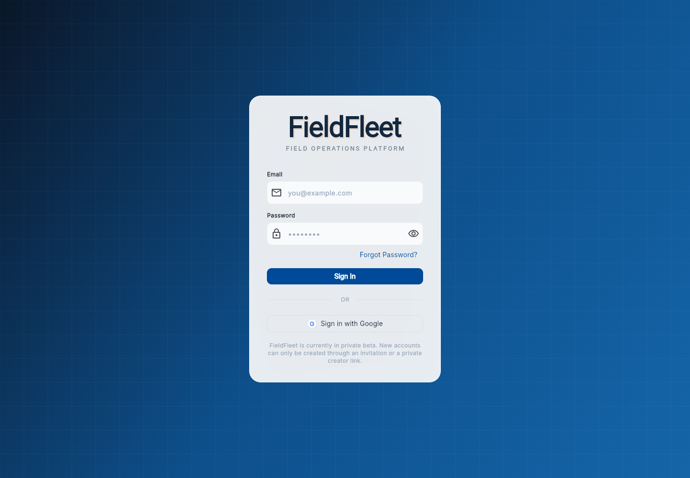
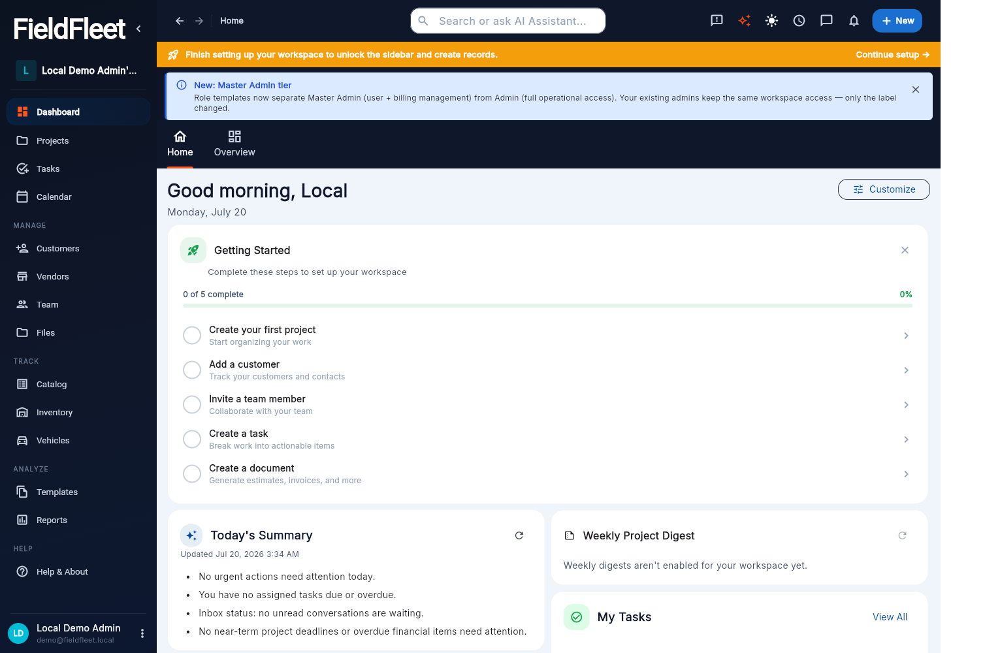

<p align="center">
  
</p>

<h1 align="center">FieldFleet</h1>

<p align="center">
  <strong>The all-in-one field operations platform for restoration, construction, and trade contractors.</strong>
</p>

<p align="center">
  <a href="LICENSE"></a>
  
  
  <a href="https://github.com/rogi-fleet/fieldfleet/actions/workflows/ci.yml"></a>
</p>

FieldFleet combines project management, CRM, scheduling, budgets and
invoicing, field data capture, and AI-assisted workflows in a single Flutter
application backed by Supabase. It is built for the way trade contractors
actually work: jobs that start with a site visit, run through crews in the
field, and end with pay applications and holdbacks.

FieldFleet is **source-available** under the
[Elastic License 2.0](LICENSE): use it, self-host it for your own business,
modify it, and contribute back. The one thing you can't do is offer
FieldFleet itself to third parties as a hosted or managed service — that
requires a commercial agreement. FieldFleet is built by
[TaskFleet](https://taskfleet.app).

## Screenshots

Screenshots below use the disposable local demo workspace documented in
[Quick Start](#quick-start).





## Why FieldFleet

Most field-service tools cover scheduling or invoicing. FieldFleet covers the
whole job lifecycle in one codebase, including the parts of field work that
generic tools miss:

- **Floor plans and room scanning** — an in-tree native room-scan plugin and an
  AI floor-plan service turn site captures into editable plans.
- **AI where it saves time** — an AI copilot for job setup, text operations,
  and daily summaries, with pluggable providers configured by environment.
- **Real financial depth** — budgets with labor rollups, pay applications,
  holdbacks, subcontracts, and bid packages, not just a totals field on an
  invoice.

## Feature Tour

**Projects & scheduling**
- Projects with budget views and project health scoring
- Dependency-aware Gantt scheduling, baselines, and capacity planning
- Tasks, work orders, change orders, and a shared calendar

**CRM & sales**
- Customers and contacts with tags, sources, statuses, and custom fields
- Opportunity pipeline with estimates and follow-ups
- Vendor management plus dedicated client, vendor, and employee portals

**Financials**
- Budgets and budget templates with labor summary rollups
- Invoicing with payment links, pay applications, and holdbacks
- Subcontracts and bid packages with multi-vendor bidding
- Cost catalog with categories, price types, and web import

**Field operations**
- Time tracking with GPS-stamped entries and reusable templates
- Dynamic field forms with e-signing (22 ready-made inspection and
  work-order forms in [`examples/`](examples/))
- Inventory, assets, and maintenance logs
- Fleet/vehicle tracking with expenses and QR codes
- Floor plans with a native room-scanning plugin

**Documents & collaboration**
- Document generation from templates, PDF output, and e-signing
- Spec books and spec sheets
- File management with folders and photo markup
- Team messaging, mentions, notifications, push, and email digests

**Platform**
- Multi-tenant workspaces with role templates and granular permissions
- Configurable dashboards, KPIs, and reporting
- Automation rules and workflow templates
- AI copilot, AI text operations, and daily AI summaries
- MCP server endpoint for AI-agent integrations

## Tech Stack & Architecture

- **Flutter / Dart** — one codebase for web, iOS, Android, macOS, Linux, and
  Windows (`lib/`, platform runners in `android/`, `ios/`, etc.)
- **Supabase** — Auth, Postgres, Storage, Realtime, and ~25 Edge Functions
  (`supabase/functions/`)
- **Postgres schema** — 280+ migrations with row-level security for
  multi-tenant isolation (`supabase/migrations/`)
- **Provider + go_router** for state and navigation
- **Integrations** — Stripe payment links, Resend, OpenRouter-compatible
  AI providers, weather — all configured through environment variables, never
  committed
- **Tests** — 41 test files covering floor-plan geometry, pricing and budget
  rollups, documents, Supabase services, and utilities (`test/`)

## Quick Start

Prerequisites: [Flutter SDK](https://docs.flutter.dev/get-started/install),
[Supabase CLI](https://supabase.com/docs/guides/cli), and Docker or Podman.

```bash
# Install dependencies
flutter pub get

# Start this checkout's isolated local Supabase stack and apply the schema
supabase start
supabase migration up --local

# Optional: create a disposable local demo login
scripts/create_local_demo_user.sh

# Run the app against local Supabase (default URL: http://127.0.0.1:55321)
flutter run -d chrome \
  --dart-define=SUPABASE_ANON_KEY=your-local-supabase-anon-key
```

The demo helper creates or verifies a local-only account:
`demo@fieldfleet.local` / `local-demo-pass`. It refuses non-local Supabase
URLs and does not run automatically, so production and shared deployments do
not inherit a default login. The first login bootstraps a demo workspace
through the normal app path.

This public checkout uses Supabase project id `fieldfleet_public` and local
ports `55321`-`55329` so it can run next to another Supabase project on the
standard `54321` ports. Before running migrations on a machine that already
has Supabase containers, use `supabase status` and `docker ps --filter
name=supabase_` to confirm which stack is active. Do not run `supabase db
reset`, `supabase migration repair`, or `supabase db pull` against a database
that contains data you need.

For a non-local environment, pass explicit build-time values:

```bash
flutter run -d chrome \
  --dart-define=ENV=prod \
  --dart-define=SUPABASE_URL=https://api.example.com \
  --dart-define=SUPABASE_ANON_KEY=your-anon-key \
  --dart-define=SITE_URL=https://app.example.com
```

Optional provider keys are supplied through environment files or secret
stores, never committed:

```text
OPENROUTER_API_KEY=
WEATHER_API_KEY=
RESEND_API_KEY=
STRIPE_SECRET_KEY=
STRIPE_WEBHOOK_SECRET=
```

See [`dart-defines.env.example`](dart-defines.env.example) for the full list.

## Self-Hosting

[`deployment/`](deployment/) contains a complete example stack for running
your own instance: Docker Compose, Kong gateway config,
Caddyfile, bootstrap migrations, deploy/backup/restore scripts, and a Flutter
config example — all with placeholder values. Start with
[`deployment/README.md`](deployment/README.md).

Further guides in [`docs/`](docs/):

- [Supabase setup](docs/SUPABASE_SETUP.md)
- [Notification matrix](docs/notification_matrix.md)
- [Messaging walkthrough](docs/messaging_walkthrough.md)
- [MCP server](docs/mcp_server.md)

## Repository Layout

```text
lib/                  Flutter application source (~45 feature areas)
supabase/             Local Supabase config, migrations, edge functions
deployment/           Example self-hosting stack with placeholder secrets
plugins/room_scan/    Native room-scan plugin
pro_room_scanner/     Standalone AR room-scanner app
examples/             22 ready-made field/inspection form templates
test/                 Dart and Flutter tests
web/ android/ ios/    Platform runners
macos/ linux/ windows/
docs/                 Setup and operations guides
scripts/              Backup/restore and maintenance scripts
```

## What Is Not Included

- Production secrets, service keys, database dumps, customer data, QA
  accounts, deployment credentials, or private operational scripts.
- Permission to offer FieldFleet to third parties as a hosted or managed
  service (see [License](#license)).
- Support, managed hosting, onboarding, backups, or updates — available from
  [TaskFleet](https://taskfleet.app).

## Security

Do not commit secrets, database dumps, authentication exports, local `.env`
files, screenshots containing customer data, or QA credentials. Before
publishing a fork, run a secret scanner such as
[Gitleaks](https://github.com/gitleaks/gitleaks) and review
[SECURITY.md](SECURITY.md) for how to report vulnerabilities.

## License

FieldFleet is distributed under the **Elastic License 2.0 (ELv2)** — the
same source-available model popularized by Elastic, Redis, and MongoDB. See
[LICENSE](LICENSE).

In plain terms, you **can**:

- Use FieldFleet in production for your own business, free of charge.
- Self-host it, modify it, and distribute your changes.
- Contribute improvements back (see [CONTRIBUTING.md](CONTRIBUTING.md)).

You **cannot**:

- Offer FieldFleet to third parties as a hosted or managed service (for
  example, selling access to a FieldFleet instance you operate).

ELv2 is not an OSI-approved open source license. For managed hosting,
white-label offerings, support agreements, or any use the license doesn't
cover, contact [TaskFleet](https://taskfleet.app).

Prefer not to run it yourself? [Renovo AI](https://renovoai.app) is
TaskFleet's fully managed, hosted field operations product.
